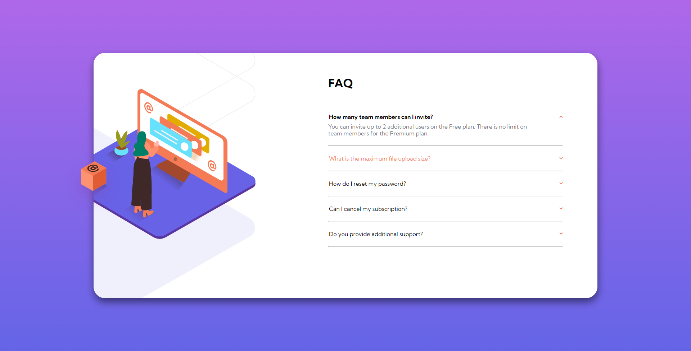
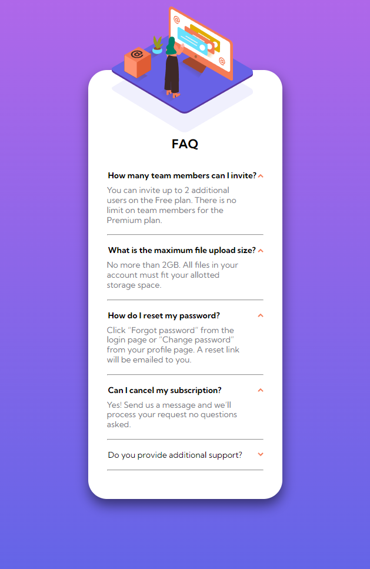

# Frontend Mentor - FAQ accordion card solution

This is a solution to the [FAQ accordion card challenge on Frontend Mentor](https://www.frontendmentor.io/challenges/faq-accordion-card-XlyjD0Oam). Frontend Mentor challenges help you improve your coding skills by building realistic projects. 

## Table of contents

- [Overview](#overview)
  - [The challenge](#the-challenge)
  - [Screenshot](#screenshot)
  - [Links](#links)
- [My process](#my-process)
  - [Built with](#built-with)
  - [What I learned](#what-i-learned)
  - [Useful resources](#useful-resources)
- [Author](#author)

**Note: Delete this note and update the table of contents based on what sections you keep.**

## Overview

### The challenge

Users should be able to:

- View the optimal layout for the component depending on the device's screen size
- See hover states for all interactive elements on the page
- Hide/Show the answer to a question when the question is clicked

### Screenshot

### Links

- [Live Site URL:](https://kmarsic.github.io/FAQ-accordion-card/)

## My process

### Built with

- Semantic HTML5 markup
- CSS custom properties
- Flexbox
- Mobile-first workflow
- JS 

### What I learned

I learned how to make an animated accordion menu animation using JS. After *many* trials and errors, I found (after a brief visit to W3Schools) that the best property to animate was the max-height property. A similar effect can be achieved with other properties such as height, grid-template rows, position, scale, translate etc. But it's not as *smooth* as when using max height.

### Useful resources

- [1](https://medium.com/outsystems-experts/how-to-achieve-60-fps-animations-with-css3-db7b98610108) - This helped me understand which properties can be animated in CSS.
- [2](https://www.w3schools.com/howto/howto_js_accordion.asp)

## Author

Frontend Mentor - [kmarsic](https://www.frontendmentor.io/profile/kmarsic)
LinkedIn - [Kristijan Maršić](https://www.linkedin.com/in/kmarsic/)
